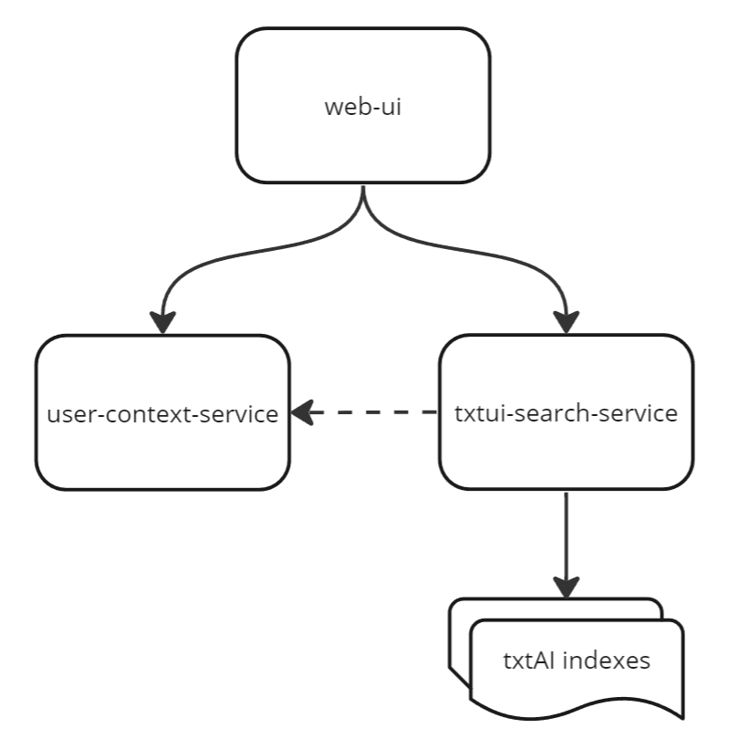

# hackathon-hacks-ai-rutube-demo

- Web UI + User Context: https://github.com/airndlab/hackathon-hacks-ai-rutube-ui
- Search service with txtAI: https://github.com/airndlab/hackathon-hacks-ai-rutube-txtai

## Run local

- Add txtAI index of videos to `/indexes/all_videos`
- Add txtAI index of channels to `/indexes/all_channels`
- Add autocomplete of titles to `/indexes/autocomplete_quieries.json`
- Run `docker compose up -d`
